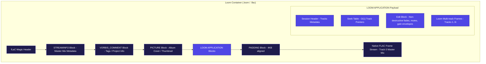

# Loom: A Session-Aware Lossless Audio Codec

[](https://www.rust-lang.org/)
[](LICENSE)
[](#hybrid-container-architecture)
[](https://github.com/aikyaam/loom/actions/workflows/ci.yml)

Loom is a high-performance, **session-aware lossless audio codec** designed specifically for multi-track audio projects, stem archiving, and Digital Audio Workstation (DAW) timeline engines. 

Unlike traditional codecs (such as FLAC or ALAC) that compress individual audio tracks in isolation, Loom operates on the entire multi-track session container. It exploits cross-track correlation to achieve superior compression ratios, implements fast time-range random access (seeking) for DAW playhead scrubbing, supports non-destructive on-the-fly edit overlays (mutes, fades, gain envelopes), and enables frame-level version diffing for localized session punch-ins.

---

## Why Loom?

Traditional lossless codecs are designed for linear, single-track playback. When applied to modern DAW music production, they introduce significant inefficiencies:
* **Redundancy:** Compressing 20 stems individually (e.g., drum kit microphones, multi-take vocals) duplicates shared timing, transients, and microphone bleed.
* **Destructive Edits:** Applying a simple fade-out or muting a region requires rendering and writing a brand-new audio file to disk.
* **Storage Bloat:** Saving successive mix revisions (e.g., `Mix_v1`, `Mix_v2`) duplicates identical, unmodified audio tracks.

**Loom** solves these issues by treating the multi-track session as a single correlated dataset with a non-destructive edit overlay.

---

## Architecture Overview

Loom uses a **Hybrid Container Architecture** built directly on top of the native FLAC format. 



### 1. Dual-Compatibility Playback
Every `.loom` file starts with the standard `fLaC` stream marker. 
* **Standard Players (VLC, hardware systems):** Recognize the file as a standard FLAC audio track. They read the primary `STREAMINFO`, ignore the custom `LOOM` application blocks, and play Track 0 (the master mix) natively.
* **Loom-Enabled DAWs/Tools:** Parse the custom `LOOM` application blocks to reconstruct the full multi-track layout, track-to-track predictive coefficients, and edit lists.

### 2. Cross-Track Predictor Loop
Loom utilizes a prediction loop to decorrelate stems. Let $E_A[n]$ be the prediction residual of the reference track (e.g., the main drum track) and $E_B[n]$ be the residual of target track B (e.g., a room mic). The cross-track residual is calculated as:
$$e_B[n] = E_B[n] - \left( \frac{W_q \cdot E_A[n]}{256} \right)$$
Where $W_q$ is an 8-bit quantized coupling weight computed dynamically on each frame to minimize entropy.

---

## Core Technical Features

1. **Entropy & Prediction Pipeline**
   * **Fixed Predictors (Orders 0-4):** Polynomial finite differences derived from Pascal's triangle.
   * **Adaptive LPC (Orders up to 32):** Linear Predictive Coding using the Levinson-Durbin recursion.
   * **Golomb-Rice Coding:** Partitioned residual coding (Rice Parameter $k \in [0, 14]$) and escape modes ($k=15$) for high-amplitude signals.
   * **Stereo Decorrelation:** Native support for Independent (L/R), Left-Side (L/S), Right-Side (S/R), and Mid-Side (M/S) channels.

2. **Non-Destructive Edits**
   * Applies linear, S-curve, and exponential fades, volume automation envelopes, and mute regions on-the-fly during decoding.
   * Updates edits in $O(1)$ time by editing only the metadata header—no audio re-compression required.

3. **Frame-Level Version Diffing**
   * Compares two session versions using PCM frame MD5 checksums.
   * Generates a localized `.diff` delta file containing only the changed frames, allowing bit-exact session restoration.

---

## Usage Guide

Ensure you have [Rust](https://www.rust-lang.org/) installed, then interact with Loom via the CLI:

### 1. Encoding Stems and Sessions
To compress a single track into a playable `.loom` file:
```bash
cargo run --release --bin loom -- encode input.wav output.loom
```

To compress a folder containing multiple parallel stems into a single multi-track session container:
```bash
cargo run --release --bin loom -- encode-session stems_directory/ session.loom
```

To attach a cover art thumbnail directly to the `.loom` file (which is visible in VLC and standard players):
```bash
cargo run --release --bin loom -- encode input.wav output.loom --thumbnail cover.jpg
```

### 2. Decoding and Range Extraction
To extract a multi-track session back into individual stem WAV files:
```bash
cargo run --release --bin loom -- decode-session session.loom output_stems_dir/
```

To extract a precise time-slice of a single track from the session (exploiting the seek index to avoid decoding irrelevant segments):
```bash
cargo run --release --bin loom -- extract session.loom --track vocals --from 5s --to 15s slice.wav
```

### 3. Modifying Playback Edits
Apply a fade-in and a mute region to a specific track inside the container:
```bash
cargo run --release --bin loom -- edit session.loom --track guitar --fade-in 0-3s --mute 12s-15s
```

Render the entire session, mixing all stems with their gain automation and edits, into a final WAV file:
```bash
cargo run --release --bin loom -- render session.loom final_mix.wav
```

### 4. Backup & Version Diffing
Generate a tiny diff file comparing two versions of a session:
```bash
cargo run --release --bin loom -- diff session_v1.loom session_v2.loom session.diff
```

Reconstruct `session_v2` bit-exactly from `session_v1` and the diff:
```bash
cargo run --release --bin loom -- apply-diff session_v1.loom session.diff reconstructed_v2.loom
```

---

## Project Structure

* [loom-core](https://github.com/aikyaam/loom/loom-core/): Main library containing prediction engines (LPC/Fixed), entropy coding (Golomb-Rice), container serialization, edit overlays, and diffing algorithms.
* [loom-cli](https://github.com/aikyaam/loom/loom-cli/): Command-line application exposing the codec tools.
* [research](https://github.com/aikyaam/loom/research/): Comprehensive design notes and papers outlining the algorithms, container constraints, and decorrelation formulas.

---

## Running the Test Suite

Run the integration and round-trip tests to verify system integrity:
```bash
cargo test -p loom-core --test roundtrip
```
